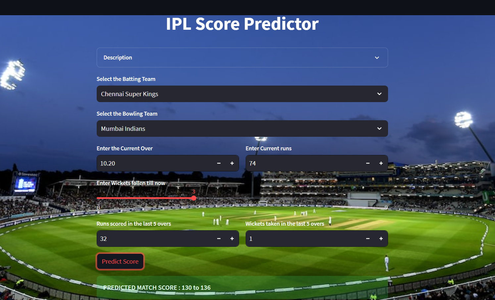

# IPL_Match_Prediction
IMPLEMENTATION OF THE GUI

The Graphical User Interface is developed for the machine learning models using the Streamlit application. For the backend of the site Python is used. All the input informationnecessary for the model for the prediction is provided to the model.

A. Score Prediction Model

The GUI requires at least 5 overs of the data to predict thescore .The model requires the input data of Batting team, Bowling team, Over, Runs, Wickets, Run Scored in last 5 overs, Wickets fall in last 5 overs to predict the score of the match as shown in the Fig.

We input the data as :

Batting team: Chennai Super Kings

Bowling team:Mumbai Indians

Current Over: 10.2

Current Runs: 74

Wickets Fallen: 3

Runs scored in Last 5 Overs: 32

Wickets taken in last 5 Overs: 1

Predicted Score Range: 130 to 136

The output we got from the model is not exactly predicted output. So, to increase the accuracy of the model we add and
subtract 3 to give the range of score as shown in Fig.. So, our model works in the majority of the cases.

B. Probability Prediction Model

The GUI requires batting team, bowling team, host city, target, current runs, overs completed, wickets out data as input to predict the probability of the IPL match as shown in the Fig.

We input the data as:

Batting team: Chennai Super Kings

Bowling team: Mumbai Indians

Host City: Mumbai

Target: 134

Score: 74

Overs Completed: 10.20

Wickets Out : 3

Output we get is:

Chennai Super Kings - 87%

Mumbai Indians - 13%

The chances of CSK winning the match is predicted by model as 87% and MI is 13 %
